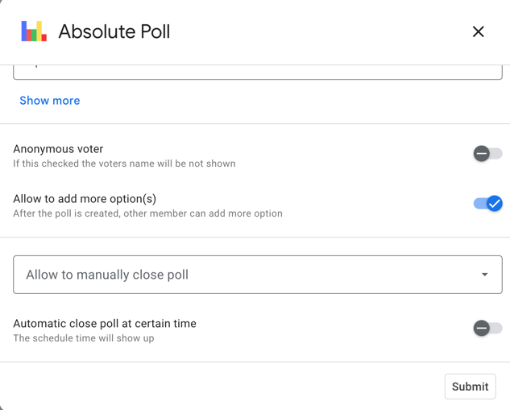
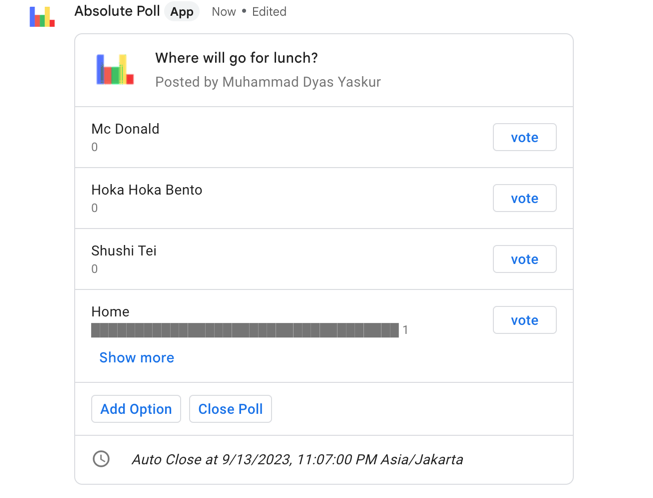

# Google Chat Poll Bot

 

Absolute Poll is a productivity software that enables you to create polls and make quick decisions within Chat. 

Screenshots:

 

This application has been installed more than **1 million times**. It is the number one and the only working poll app in the Google Apps Marketplace.

For anyone who is interested, you can install my application using the following URL:
https://workspace.google.com/marketplace/app/absolute_poll/687007803052

I also have a landing page for the application, although I must admit it was created more out of necessity for Google's review requirements rather than as a serious component:
https://absolute-poll.yaskur.com/

Original Feature:
- Create poll
- Record vote
- Doesn't using any database. (Vote records are saved in chat message)

What I updated are:
- [x] Upgrade Card v1 to Card v2
- [x] Unit Test (ready to TDD)
- [x] Save voter names
- [x] Anonymous vote
- [x] Add more option after poll is created
- [x] Migrated to Typescript
- [x] Close the poll
- [x] Schedule close poll
- [x] Multiple choice vote(1 user can vote on more than 1 choice)

Todo:

- [ ] Duplicate Poll
- [ ] Save state to database
- [ ] Schedule poll
- [ ] Other features (suggest me please...)
- [ ] Deno or Cloudflare worker support (hopefully can)
- [ ] Porting to Golang (will create another repo)

Limitation:
- Since the data state is saved in chat message at yet, there is maximum that can be save (I am still finding out the limit) my SO question : https://stackoverflow.com/questions/75478309/what-is-the-limit-of-google-chat-message-card-via-chatbot
- Currently, only tested and worked using GCP cloud function, I will test later using Azure function, AWS lambda, Tencent OCF, and other FaaS/serverless service

Tips: You can test the json file on **tests/json** folder to https://gw-card-builder.web.app/ to view the output of the application.

This code just my learning code. That's why I don't directly migrate to TypeScript or Golang in early stage. 
I just want to learning nodejs and google chat apps.
Feel free if you have suggestion or advice for this apps and codes.

