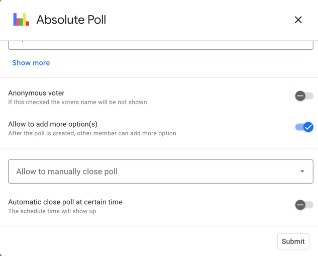
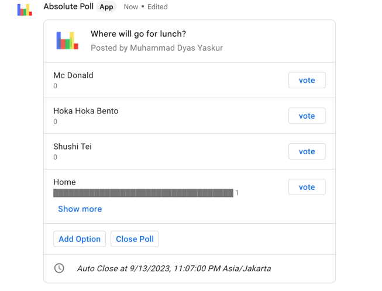

# Absolute Poll - Google Chat Poll Bot

[](https://github.com/dyaskur/google-chat-poll/actions)
[](https://coveralls.io/github/dyaskur/google-chat-poll)
[](https://sonarcloud.io/summary/new_code?id=dyaskur_google-chat-poll)
[](https://sonarcloud.io/summary/new_code?id=dyaskur_google-chat-poll)
[](https://sonarcloud.io/summary/new_code?id=dyaskur_google-chat-poll)

A Google Chat add-on for creating polls and making quick decisions within Google Chat. Built with TypeScript and deployed to Google Cloud Functions.

**Installed over 1 million times** — the #1 poll app on the Google Workspace Marketplace.

<a href="https://workspace.google.com/marketplace/app/absolute_poll/687007803052?pann=b" target="_blank" aria-label="Get it from the Google Workspace Marketplace">
  
</a>

Landing page: https://absolute-poll.yaskur.com/

## Screenshots

 

## Features

- Create polls with multiple choices
- Single or multiple choice voting (configurable vote limit)
- Anonymous voting option
- Add more options after poll is created
- Close polls manually or on a schedule with auto-close
- Reminder notifications before auto-close
- Permission control (creator-only or anyone can close)
- No database required — poll state is stored directly in the chat message

### Todo

- [ ] Duplicate Poll
- [ ] Save state to database
- [ ] Schedule poll
- [ ] Deno or Cloudflare worker support

## Getting Started

### Prerequisites

- Node.js 22+
- Yarn
- Google Cloud SDK (for deployment)

### Installation

```bash
yarn install
```

### Development

```bash
yarn start        # Start local dev server via functions-framework
yarn build        # Compile TypeScript
yarn test         # Run tests with coverage
yarn eslint .     # Lint
```

### Deployment

Create a `.env.yaml` file with:

```yaml
FUNCTION_REGION: asia-southeast1
GCP_PROJECT: your-project-id
QUEUE_NAME: your-queue-name
```

```bash
yarn deploy       # Build + deploy to GCP with env vars from .env.yaml
yarn release      # Build + deploy to GCP (production, uses env vars already set in GCP)
```

## Limitations

- Since poll state is stored in the chat message, there is a maximum data size limit. See [this SO question](https://stackoverflow.com/questions/75478309/what-is-the-limit-of-google-chat-message-card-via-chatbot) for details.
- Currently only tested on GCP Cloud Functions.

## Tips

You can test the JSON files in the `tests/json` folder at https://gw-card-builder.web.app/ to preview the card output.

## License

MIT
